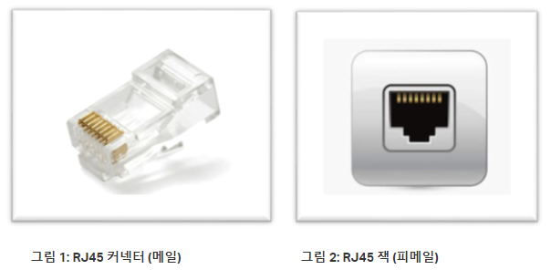

### **넌 왜 이렇게 꼬였냐? LAN 케이블이냐?**

컴퓨터에서 송신 된 패킷은 허브나 라우터라는 중계 장치에 의해 중계 되어 목적지를 향해 진행합니다.  

이번 장은 LAN 어댑터에서 떠난 패킷이 케이블로 나가는 부분부터 시작됩니다. 

LAN 어댑터의 PHY(MAU) 회로에서 전기 신호로 형태를 바꾼 패킷은 RJ-45 커넥터를 통해 트위스트 페어 케이블(한 쌍으로 꼬아 놓은 선)에 들어가게 됩니다. 
 

 
이더넷 신호의 실체는 플러스와 마이너스의 전압이므로 LAN 어댑터의 `PHY(MAU) 회로` 의 플러스와 마이너스 신호 단자에서 신호가 나온다고 생각 할 수 있습니다. 

이 신호는 2개의 신호선이 1개조로 총 8조로 꼬여있는 `트위스트 페어 케이블`을 통해 리피터 허브의 `RJ-45 커넥터`로 전달 되며 신호선의 배치는 양 끝이 모두 같습니다. 

전달 된 신호는 각이 뭉개져 둥글게 되거나 잡음의 영향으로 신호의 파형이 외곡 되는등 케이블의 길이가 길수록 신호가 약해지거나 변질됩니다. 
 

이 현상은 전기 신호의 성질과 관계가 있습니다. 신호의 각진 부분은 전압이 급격히 변화하는데 이것은 해당 부분의 주파수가 높다는 의미입니다. 

주파수가 높은 신호는 약하지므로 급격한 변화가 없어져서 각이 뭉개집니다.
 

이처럼 신호가 변형되는 것은 잡음이 없고 조건이 좋은 경우에도 발생하는데 잡음의 영향까지 받으면 약해진 신호가 더욱 변형되므로 0과 1을 잘못 판독하는 지경이 되고 이것이 통신 오류의 원인이 됩니다. 
 

`LAN 케이블`로 사용하는 `트위스트 페어 케이블은 케이블`을 `꼼`으로써 이러한 잡음의 영향을 억제하는 대책을 마련했습니다. 

`잡음`의 원인은 케이블 주위에서 발생하는 전자파로 케이블의 주위에 전자파가 있으면 신호와는 다른 전류가 케이블 안에 흐르게 됩니다. 

신호도 전압에 의해 생기는 일종의 전류이므로 잡음에 의해 생기는 전류와 구분이 되지 않기 때문에 신호와 잡음의 전류가 뒤섞여 신호의 파형이 변형 되는 것입니다. 
 

이러한 잡음은 모터, 형광등, CRT 모니 터와 같은 기기들에서 누설되는 전자파와 케이블 내에서 인접한 신호선끼리 누설되는 전자파입니다. 

외부에서 오는 잡음은 신호선에 전자파가 닿을 때 전자파의 진행 방향의 오른쪽으로 전류가 발생하는 성질을 이용해 신호선을 나선형으로 꼼으로써 해결합니다. 

신호선을 마주 꼬면 형태가 나선형이 되어 전류가 흐르는 방향이 반대가 되어 잡음이 상쇄되는 것이죠. 

내부에서 발생하는 전자파는 케이블 안의 인접한 신호선에서 누설되는 전자파로 이러한 잡음에 의한 영향을 `크로스토크(closstalk)`라고 합니다. 
 

이 잡음은 원래 강한 것이 아니지만 전자파가 가까운 곳에서 발생 되어 약해지기 전에 신호선에 닿아 전류를 발생시키는 것이 문제입니다. 

내부 잡음 역시 신호선을 마주 꼬는 것으로 해결이 가능한데 꼬는 간격을 미묘하게 변화시켜 잡음을 상쇄시키는 방법을 사용합니다. 

뿐만 아니라 신호선 사이에 구분판을 넣거나 금속성의 차폐 목적의 피복을 입혀 전자파를 차단하는 방법 등 여러 방법을 사용하고 있습니다. 

때문에 성능이 다른 케이블들이 시판되고 있으며 `카테고리(CAT)`라는 척도로 성능을 나타냅니다. 
 

---
 

### **리피터 허브 먹이 금지**
 

신호가 `리피터 허브`에 도착하면 리피터 허브는 연결 된 모든 `LAN 전체에 패킷`의 신호를 뿌립니다.  

리피터 허브에서 신호를 받으려면 상대의 `송신 단자`에서 보낸 신호를 `수신 단자`로 받도록 해야 합니다. 

리피터 허브에서 끝의 커넥터에는 `MDI/MDI-X`와 같이 쓰여있는 전환 스위치가 있는데, 허브끼리 접속 할 때는 각각 한쪽이 MDI, MDI-X여야 합니다.  
만일 모두 MDI-X일 경우는 PC끼리 접속하는 경우와 같이 `크로스 케이블`로 연결합니다. 

`MDI(Media Dependent Interface)`는 RJ-45 커넥터와 신호 송,수신 회로를 직접 결선한 것이고`MDI-X(MDI-Crossover)`는 교차하여 결선하는 것을 나타냅니다. 
 

리피터 허브에서 PHY(MAU) 회로의 수신부에 도달한 신호는 리피터 회로에 들어가게 됩니다. 

리피터 회로는 연결 된 모든 케이블에 신호를 전체 발송하는 것이 기본입니다. 

리피터 회로에서 발송된 신호는 연결 된 모든 기기에 전달 되고 수신처는 MAC 주소를 조사하여 자신이 수신처에 해당하면 수신하고 아니면 패킷을 폐기하여 무시합니다. 
 

리피터 회로의 기본은 신호를 그대로 뿌리는 것이기 때문에 잡음의 영향을 받거나 데이터가 변한 경우에도 그대로 전달합니다. 

이 경우 스위칭 허브, 라우터, 서버 등 다음 기기들에서 디지털 데이터로 변환되거나 `FCS` 검사하는 과정에서 데이터 오류가 검출되어 폐기 됩니다. 

이 경우 수신 확인 응답을 받지 못한 송신측 프로토콜 스택의 TCP 부분이 패킷을 재전송하게 됩니다. 
 

---
 

#### **PHY(MAU)**

이더넷 파생 방식에 따라 신호 송,수신 회로의 호칭이 다른데, 현재 `100Mbps 이상의 이더넷`은 `PHY(Physical Layer Device)`라 부릅니다. 

PHY 이전의 저속 방식 중에는 `MAU(Medium Attachment Unit)`이라 부르는 것도 있습니다. 

때문에 책에서는 이를 혼합하여 설명하고 있습니다. 
 

---
 

#### **트위스트 페어 케이블 카테고리**

-   `10BASE-T` : 10메가바이트 이더넷
-   `100BASE-TX` : 100메가바이트 이더넷
-   `1000BASE-T` : 1기가비트 이더넷
-   `1000BASE-TX` : 1기가비트 이더넷, 데이터 전송을 위해 4 쌍 대신 두 쌍의 와이어를 사용.  
    하나는 500Mbps 속도로 데이터를 전송하고 다른 하나는 비슷한 속도로 데이터를 수신.  
    이를 통해 1000BASE-T에 비해 회로가 적은 장치를 지원할 수 있음.
-   `10GBASE-T` : 10기가비트 이더넷
-   `25GBASE-T` : 25기가비트 이더넷
 
 

1\. `카테고리 5`(CAT-5)

-   10BASE-T과 100BASE-TX에 사용하는 케이블  
    최대 125MHz의 신호를 지원하는 케이블

2\. `향상된(enhanced) 카테고리 5`(CAT-5e)

-    최대 1000BASE-T, 250MHz의 신호를 지원하는 케이블  
      기가비트 이더넷용으로 만들어 진 것으로 카테고리 5를 개량하여 크로스토크의 특성을 개선함

3\. `카테고리 6`(CAT-6)

-   최대 1000BASE-T, 250MHz의 신호를 지원하는 케이블

4\. `증강된(augmented) 카테고리 6`(CAT-6a)

-   최대 1000BASE-TX, 500MHz의 신호를 지원하는 케이블  
    카테고리 6을 개량하고 에일리언 크로스토크라는 특성을 개선한 것

5\. `카테고리 7`(CAT-7)

-   최대 10GBASET-T, 600MHz의 고속 신호를 지원하는 케이블

6\. `증강된(augmented) 카테고리 7`(CAT-7a)

-   최대 10GBASE-T, 1000MHz의 고속 신호를 지원하는 케이블

7\. `카테고리 8`(CAT-8)

-   최대 25GBASE-T, 2000MHz의 고속 신호를 지원하는 케이블  
    다른 커넥터 사용으로 CAT5e, CAT6와 호환되지 않음
