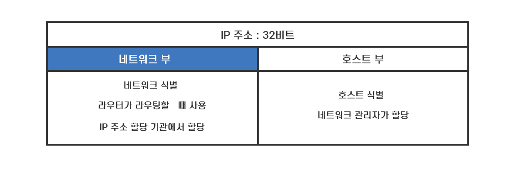

#### 허브 뿌렸으면 라우터로 가자

`리피터 허브` 또는 `스위칭 허브`를 경유한 `패킷`은 결국 `라우터`에 도착하고 라우터에서 다음 라우터로 중계가 이어집니다. 

라우터는 크게 `중계 부분`과 `포트 부분`으로 나눌 수 있는데 이 중 포트 부분은 LAN 어댑터와 같다고 생각 할 수 있습니다. 
LAN 어댑터를 교환해서 이더넷 뿐 아니라 무선 LAN도 지원 할 수 있다는 점도 같은데, 라우터는 하드웨어를 장착하면 `FTTH`,  `ADSL`과 같은 `광대역 회선`을 이용 할 수도 있습니다. 

따라서 포트에서 패킷을 수신 할 때 이더넷인지 무선 LAN인지 등에 따라 해당 규칙을 따라 패킷을 수신합니다. 
수신한 이후에는 중계 부분으로 패킷을 넘기면 패킷의 IP 헤더에 기록되어 있는 `수신처 IP 주소`와 `중계 대상`을 등록한 표를 대조하여 중계 대상을 판단합니다. 
그리고 중계 대상 측의 포트로 패킷을 옮기고 포트 부분의 `하드웨어 규칙`에 따라 송신 동작을 실행합니다. 
스위칭 허브는 들어온 패킷을 다시 전송하기만 하는 것과 달리 `라우터`는 자신이 `송신처`나 `수신처`가 되는 점이 차이입니다. 

책에서는 이더넷에 초점을 맞춰 설명합니다. 
이더넷의 포트 부분의 구조는 PC에서의 LAN 어댑터와 거의 같아서 패킷을 수신하고 버퍼 메모리에 저장하기까지의 동작이 모두 동일합니다. 

라우터는 패킷 수신 동작이 끝나면 맨 앞에 위치한 `MAC 헤더`를 `폐기`합니다. 
MAC 헤더의 역할은 라우터에 패킷을 건네주는 것이기 때문에 더 이상 사용하지 않습니다. 

이 다음으론 MAC 헤더 뒤에 있는 IP 헤더의 내용을 보고 패킷 중계 동작에 들어가는데 순서는 다음과 같습니다. 
1. 수신한 패킷의 `수신처 IP 주소`와 `넷마스크 항목`의 값을 참조하여 `경로표의 수신처 항목`을 조사하여 해당하는 행 찾음
2. 복수의 행일 경우 `네트워크 번호`의 `비트 수가 가장 긴 것`을 찾음 
	1. 네트워크 번호의 비트 수가 길면 호스트 번호의 비트 수가 짧아짐
	2. 호스트 번호의 비트수가 짧다는 건 호스트 번호로 할당 가능한 번호 수가 적다는 의미
	3. 서브넷에 접속 가능한 기기 수가 적다는 의미로 범위가 축소 됨
	4. 범위를 계속 축소해서 가장 확률적으로 높은 곳을 선택하여 중계 대상으로 삼음
3. 네트워크 번호의 길이가 같은 경우 `메트릭` 값이 작은 쪽을 선택
4. 해당하는 행이 없을 경우 패킷을 폐기하고 `ICMP 메시지`로 송신처에 이 사실을 알림
5. 라우팅 테이블 마지막 행은 `넷마스크` 항목이 `0.0.0.0`으로 지정 할 경우 어떤 IP도 해당하기 때문에 이 행에 등록 된 `게이트웨이`가 기본 게이트웨이(기본 경로)로 설정되어 해당 라우터로 중계 함
 

 

#### 중계 맛집 라우터
라우터 중계 원리는 중계 대상을 등록한 표를 참조하여 패킷을 어디로 보낼지 판단하는 점에서 스위칭 허브와 비슷한데 중요한 다른 점은 스위칭 허브는 이더넷을 바탕으로 하지만 라우터는 IP를 바탕으로 동작한다는 점입니다. 
스위칭 허브가 MAC 헤더에 기록되어 있는 수신처 MAC 주소로 중계 대상을 판단한다면 라우터는 IP 헤더에 기재되어 있는 수신처 IP 주소로 중계 대상을 판단합니다. 

취급하는 주소가 다르므로 중계 대상의 주소를 등록하는 테이블의 내용도 다릅니다. 

라우터의 테이블은 `라우팅 테이블` 또는 `경로표`라고 부르며 `수신처`, `넷마스크`, `게이트웨이`, `인터페이스`, `메트릭`과 같은 정보를 등록합니다. 
`수신처 항목`에는 `네트워크 번호` 부분의 비트에만 값이 있고 `호스트 번호 부분`의 비트 값은 모두 0으로 된 IP주소가 들어 있습니다. 
라우터는 이 항목에 등록되어 있는 IP 주소와 수신한 패킷의 수신처 IP 주소의 네트워크 번호 부분을 비교하여 그 행에 해당하는지 판단합니다. 
비교함에 있어 네트워크 번호의 비트수를 판단해야 하므로 경로표에는 `넷마스크 항목`도 마련되어 있습니다. 

여기서 끝나면 참 좋으련만 `라우터는 실전`입니다. 
`주소 집약`이라는 개념을 이용하면 몇 개의 서브넷을 모아서 한 개의 서브넷으로 간주한 후 묶음 서브넷을 경로표에 등록할 수 있습니다. 
이 경우 서브넷에 할당된 넷마스크의 값과 경로표에 등록된 넷마스크의 값이 다를 수 있습니다. 
같은 서브넷 안에서 여러 서브넷이 매번 같은 라우터로 중계 되는 경우 이 `서브넷들을 추상화` 한다고 이해할 수 있습니다. 

이정도면 된거 같은데 이와 반대로 한 개의 서브넷을 `세분화`하여 경로표에 복수 등록하는 경우도 있습니다. 이 방법을 사용하면 호스트 번호 부분에 값이 들어있는 개별 컴퓨터를 나타내는 주소를 수신처 항목에 등록할 수 있습니다. 

수신처와 넷마스크를 제외한 `게이트웨이(IP주소)`, `인터페이스(포트)` 항목은 `패킷의 중계 대상`을 나타내며 `메트릭`은 수신처 IP 주소에 기록되어 있는 `목적지가 가까운지` 멀리 있는지에 대해 나타냅니다. 

스위칭 허브는 패킷을 중계하면서 MAC 주소 테이블을 갱신했지만 라우터는 `갱신`과 `중계`가 `분리` 되어 있습니다. 
라우팅 테이블은 사람이 `수동으로 경로를 등록` 또는 `갱신`하거나 `라우팅 프로토콜` 구조를 사용하여 라우터들끼리 경로 정보를 교환하게 하여 자체 등록합니다. 
라우팅 프로토콜은 어느 프로토콜을 지칭하는 것이 아니라 `RIP`(Routing Information Protocol),`OSPF`(Open Shortest Path First), `BGP`(Border Gateway Protocol) 등의 복수의 프로토콜이 존재합니다. 
 

 

####  경로표는 경로 우대해주냐

경로표에서 중계 대상을 찾아내면 패킷을 출력 측의 포트로 옮기고 송신하는데 이 때 `TTL`(Time To Live)라는 `IP 헤더의 필드`를 갱신합니다. 
라우터를 경유할 때 마다 이 값을 1씩 줄이다가 숫자가 0이 되면 폐기합니다. 
이 값은 라우터를 순환하며 고립되는 것을 막기 위한 것으로 송신처가 패킷을 송신 할 때 `64 `또는 `128`의 값을 설정하는데 지구 반대편까지 경유해도 많아야 수십 개이기 때문에 충분한 크기입니다. 

라우터가 이더넷 뿐 아니라 LAN이나 통신 회선으로 출력 할 경우 종류에 따라 패킷의 최대 길이가 달라지므로 송신 측 보다 수신 측의 패킷 최대 길이가 작을 수 있습니다.  
이 경우 `IP 프로토콜`에 규정 된 `조각 나누기(fragmentation)`을 사용하여 패킷을 분할하여 중계하는데 이는 TCP가 데이터를 조각으로 분할하는 것과 다릅니다.  
TCP는 분할되지 않은 데이터를 분할하지만 IP는 패킷이 만들어진 후에 분할하기 때문에 이미 한번 분할 된 데이터입니다. 

라우터는 먼저 출력 측 `MTU`를 조사하고 패킷의 `IP 헤더의 플래그 필드`에서 `분할 가능 여부`를 확인합니다. 
분할 불가일 경우 폐기하고 `ICMP 메시지`로 송신처에 통지하고 분할 가능일 경우 맨 앞부분부터 `MTU`에 맞춰 잘라냅니다. 
이때 잘라내고 남은 나머지 부분이 분할 대상 데이터가 되는데, 분할 한 데이터 앞에 MAC 헤더와 조각 나누기에 관한 정보를 덧붙인 IP 헤더만 붙여줍니다. 

송신 준비가 끝나면 최종적으로 MAC 헤더의 맨 앞에 있는 수신처 `MAC 주소 필드`에 값을 설정하기 위해 `라우팅 테이블`의 `게이트웨이 항목`에서 패킷을 건네줄 상대를 판단합니다. 
이 항목에 IP 주소가 쓰여 있으면 해당하는 라우터로 전달하고 없으면 최종 목적지인 IP 헤더의 수신처 IP 주소로 전달합니다. 
상대 IP 주소가 결정되면 ARP로 IP 주소에서 MAC 주소를 조사하고 결과를 수신처 MAC 주소로 설정합니다. 

이렇게 송신용 패킷이 만들어지면 전기 신호로 변환하여 포트로 송신하는데 이는 컴퓨터와 같습니다. 

#### 라우터의 부가 기능

인터넷이 일반에 공개 된 후 주소 부족을 대처하기 위해 고안된 주소 변환은 사내용 주소는 `프라이빗 주소`, 이외 고유한 주소는 `글로벌 주소`로 부릅니다. 
프라이빗 주소의 규칙은 사내에서 사용하는 범위를 한정하는 것 뿐입니다. 

> 10.0.0.0 ~ 10.255.255.255 
172.16.0.0 ~ 172.31.255.255 
192.168.0.0 ~ 192.168.255.255 

주소 변환의 구조는 패킷을 중계 할 때 IP 헤더에 기재 된 IP 주소와 포트 번호를 바꿔 쓰는 것입니다. 

먼저 TCP의 접속 동작에서 최초로 흐르는 패킷을 인터넷에 중계 할 때 송신처의 IP 주소를 프라이빗 주소에서 글로벌 주소로 바꿔 씁니다. 
사실 책에 나온 설명보다는 `공인 IP`와 `사설 IP`의 `포트 포워딩`에 대해 설명한 [블로그](https://badayak.com/entry/%EC%99%B8%EB%B6%80%EC%A0%91%EC%86%8D%EC%9D%84-%EC%9C%84%ED%95%9C-iptime-%ED%8F%AC%ED%8A%B8%ED%8F%AC%EC%9B%8C%EB%94%A9-%EC%84%A4%EC%A0%95-%EB%B0%A9%EB%B2%95) 글을 읽는 게 나아 보입니다. 
`IPTime`으로 자주 하는 일 중 하나 입니다. 규모에 차이가 있을 뿐 가정에서의 LAN도 동일합니다. 

또 다른 부가 기능인 `패킷 필터링`은 패킷을 중계 할 때 `MAC 헤더`, `IP 헤더`, `TCP 헤더`에 기록되어 있는 내용을 조사하여 그것이 사전에 설정한 조건에 부합하면 중계하고 아니라면 폐기합니다. 

대부분의 `방화벽`이라는 기기 또는 소프트웨어는 이 원리를 이용해 부정 침입을 방지합니다. 

 

 

#### IP 주소의 구성 - 네트워크 부와 호스트 부

[출처 : [변계사 Sam의  테크 스타트업!:티스토리]](https://better-together.tistory.com/118)

> IP 주소는 어느 네트워크의 어느 호스트라는 것을 식별하는 주소입니다.  
> 따라서 IP 주소는 호스트가 속한 네트워크 주소인 네트워크 부(Network Part 또는 Network ID)와 호스트의 주소인 호스트 부 (Host Part 또는 Host ID)로 구성됩니다.  
> 즉, 네트워크 부는 어떤 네트워크 인지를 나타내 다른 네트워크와 구분하는 역할을 하고, 호스트 부는 해당 네트워크의 어느 호스트인지를 나타내 다른 호스트와 구분하는 역할을 합니다. 여기서 호스트는 컴퓨터뿐만이 아니라 IP 주소가 할당되는 라우터를 포함합니다.  
따라서 같은 네트워크 안에 있는 컴퓨터, 즉 라우터 없이도 데이터 전송이 가능한 컴퓨터는 네트워크 부가 동일하고 호스트 부만 다릅니다.  
달리 말하면 네트워크 부가 다르다는 것은 서로 다른 네트워크라는 의미이고, 라우터를 통하지 않고는 통신이 불가능하다는 뜻입니다.  
서로 다른 네트워크가 라우터를 통해 통신이 가능한 것은 라우터가 IP 주소의 네트워크 부를 보고 라우팅을 하여 데이터를 전송하기 때문입니다. 

> IPv4의 주소에서는 어디까지가 네트워크 부이고, 어디까지가 호스트 부일까요?  다시 말해 <그림 1>의 IP 주소 203.179.33.13에서 어디까지가 네트워크 부이고, 어디까지가 호스트 부일까요? 네트워크 부와 호스트 부를 어떻게 식별할까요? 
IPv4 도입 초기에는 클래스(class)를 기준으로 네트워크부와 호스트를 나누는 방식을 사용했지만, 클래스 방식의 비효율성으로 인해 현재는 클래스에 구애받지 않고 서브넷 마스크(subnet mask) 방식을 사용하고 있습니다.

